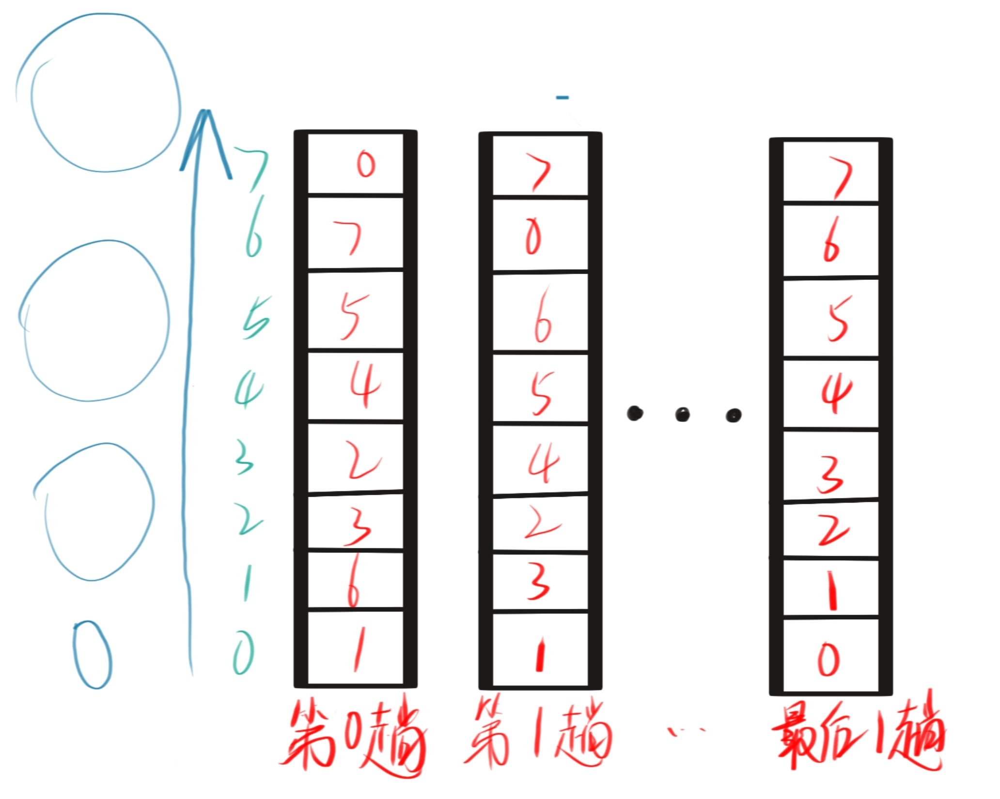

# Go Sorting Algorithms

## 项目简介
该项目实现了经典排序算法，包括冒泡排序、快速排序、归并排序等，旨在练习 Go 语言的基础语法、算法实现和单元测试。

## 算法列表
- Bubble Sort
- hill Sort
- insert Sort
- select Sort
- Quick Sort
- Merge Sort 
- pile Sort 
- count Sort (计划中)
- bucket Sort (计划中)
- cardinal Sort (计划中)

## 快速运行
```bash
go run cmd/main.go
```


## 冒泡排序--(交换排序)

### 算法介绍
交换排序的基本思想：两两比较待排序记录的关键字，发现记录不满足次序要求时则进行交换，直到整个序列全部都满足要求为止。
**冒泡排序**则是一种最简单的交换排序方法，它通过两两比较相邻记录的关键字，如果发生逆序则进行交换，从而使得关键词大的记录向下"坠落"(右移),关键词小的记录向上"漂浮"(左移)。
每趟遍历交换结束后，最大的值被挤到最后一个位置，还能同时理顺部分数据的次序。
一旦某一趟没有发生交换则可以提前结束排序。

### 思想:
冒泡排序(Bubble Sorting)的**基本思想**:

1. **从数组头部开始遍历，进行相邻元素比较和交换，大的元素像气泡一样向后移动**
2. 如下图所示，重点关注数字6和7。



### 算法步骤

- 从数组头部开始遍历，进行交换。
- 不停向后移动索引。

**步骤1：**确定比较轮数，假设n=8，也就是待排序列个数，那需要比较n-1轮。

```go
arr := []int{1, 6, 3, 2, 4, 5, 7, 0}
n := len(arr)

for i := 0; i < n-1; i++ {
```

**为什么是 n-1 轮？**

- 每轮都能确保一个最大的数在数组最后面
- n 个元素需要 n-1 轮来确保全部有序

**步骤2：**每轮比较相邻元素

```go
for j := 0; j < n-i-1; j++ {
    if arr[j] > arr[j+1] {
       arr[j], arr[j+1] = arr[j+1], arr[j]
    }
}
```

**步骤3：**优化 - 提前结束

```go
swapped := false
// ... 在交换时设置 swapped = true
if !swapped {
    break  // 如果本轮没有交换，说明已完全有序
}
```

**完整代码**：

```go
package main

import "fmt"

func main() {
	arr := []int{1, 6, 3, 2, 4, 5, 7, 0}
	n := len(arr)
	for i := 0; i < n-1; i++ {
		swaped := false
		for j := 0; j < n-i-1; j++ {
			if arr[j] > arr[j+1] {
				arr[j], arr[j+1] = arr[j+1], arr[j]
				swaped = true
			}
		}
		if !swaped {
			break
		}
	}
	fmt.Println(arr)
}
```

### 时间复杂度

#### **最好情况** - O(n)

当数组已经是有序状态时：

```go
arr := []int{0,1, 2, 3, 4, 5, 6, 7 }
```

- 只需要进行**第一轮**比较
- 比较次数：n-1 次
- 交换次数：0 次
- 通过 `swapped` 标志检测到无交换，提前结束

#### **最坏情况** - O(n²)

当数组完全逆序时：

```go
arr := []int{ 7, 6, 5, 4, 3, 2, 1,0}
```

- 需要完成所有 n-1 轮比较
- 总比较次数 = (n-1) + (n-2) + ... + 1 = n(n-1)/2
- 总交换次数 = n(n-1)/2（每对相邻元素都需要交换）

#### **平均情况** - O(n²)

对于随机排列的数组：

- 比较次数：≈ n²/2
- 交换次数：≈ n²/4（平均一半的比较会导致交换）

**适用场景：**

- 小规模数据（n < 100）
- 数据基本有序的情况
- 教学目的（算法简单易懂）

**不适用场景：**

- 大规模数据（n > 1000）
- 对性能要求高的场景

冒泡排序的主要价值在于其**简单性**而非效率！